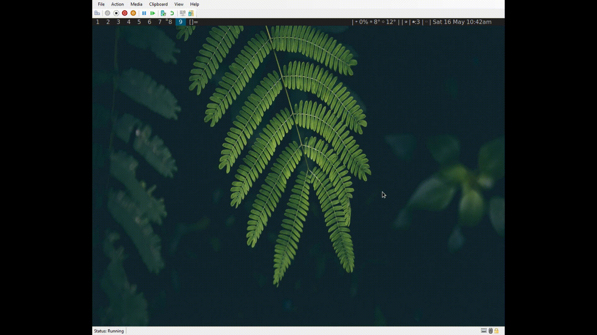

# dmenu-bm

Just a couple scripts to pull together bm and dmenu to create a simple easily accessible bookmarks manager.

Blog post talks through it here: [Blog post](https://owendavies.net/articles/dmenu-bookmarks-with-bm/)

# Example gif

